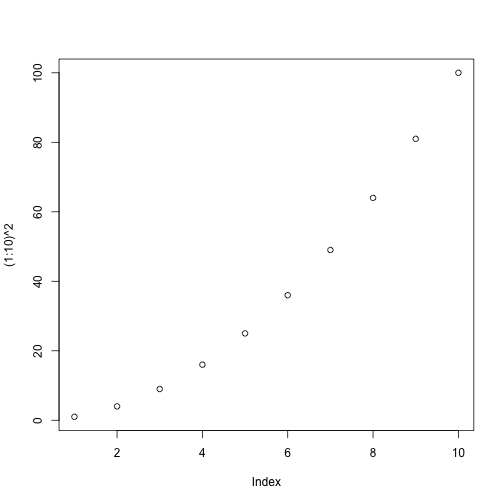

# Hello, Markdown!

This is my first automatically generated report, 
where I print message and stuff.


```r
print("G'day!")
```

```
## [1] "G'day!"
```

```r
print(2 + 2)
```

```
## [1] 4
```

```r
plot((1:10)^2)
```



Thank for your attention.
